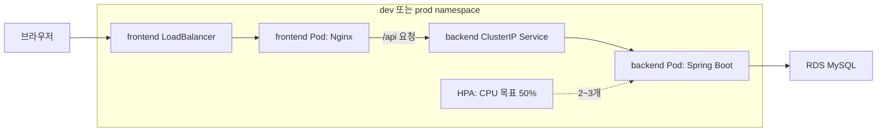

# BookShelf — AWS EKS 배포

앞선 프로젝트에서 만든 도서 관리 서비스를 AWS에 배포했습니다.
팀에서 프런트엔드·백엔드의 Docker 이미지, EKS 배포 설정, 개발·운영 환경 분리를 맡았습니다.

2026.06 · KT AIVLE 미니프로젝트 6차 · 팀 프로젝트

## 배포 구성

프런트엔드는 Nginx, 백엔드는 Spring Boot 이미지로 만들고 ECR에 올렸습니다.
CodeBuild의 이미지 빌드와 배포 단계를 나누고, EKS의 `dev`와 `prod` namespace에 각각 배포하도록 구성했습니다.

- [Dockerfile](backend/Dockerfile) · [이미지 빌드](buildspec.yml)
- [개발 배포](buildspec-deploy-dev.yml) · [운영 배포](buildspec-deploy-prod.yml) · [환경 분리 PR](https://github.com/aivle-b-t24/6-mini-project24/pull/2)

사용자 요청은 LoadBalancer를 거쳐 프런트엔드 Nginx로 들어옵니다.
화면은 Nginx에서 제공하고, `/api` 요청은 클러스터 내부의 백엔드 Service로 전달합니다.

## 배포 확인

프로젝트 당시 운영 파이프라인 실행 화면입니다. 이미지 빌드와 배포 단계를 나누고 개발·운영 환경에 각각 배포하도록 구성했습니다.

## 배포하면서 수정한 부분

**화면 경로와 API 경로 분리**

프런트엔드 화면 경로와 API 요청 경로가 충돌해, API 요청에 `/api` 접두어를 붙였습니다.
프런트엔드의 API 기본 주소와 Nginx 프록시 설정을 함께 바꿨습니다.

[Nginx 설정](frontend/nginx.conf) · [수정 커밋](https://github.com/aivle-b-t24/6-mini-project24/commit/e1d0bb486b0758bd81e33d464d8143e607493b82)

**DB 연결 한도를 고려한 HPA 설정**

백엔드 Pod가 늘어나면 DB 연결 수도 함께 늘어나므로, DB 연결 한도를 고려해 최대 복제 수를 5개에서 3개로 낮췄습니다.
CPU 목표를 50%로 두고 부하를 줬을 때 Pod가 2개에서 3개로 늘어나고, 3개 모두 Ready 상태가 되는 것을 확인했습니다.

[HPA 설정](k8s/dev/backend-hpa.yaml) · [상한 조정 커밋](https://github.com/aivle-b-t24/6-mini-project24/commit/c0413d5a7ee78d193ebc71d78489c33fac2fa73c)

## 실행과 상세 구성

- [로컬 실행·CI/CD·모니터링](docs/technical-details.md)
- [개발 환경 설정](k8s/dev) · [운영 환경 설정](k8s/prod)
- [원본 팀 저장소](https://github.com/aivle-b-t24/6-mini-project24)

현재 데모 주소는 접속되지 않습니다(2026.09.20 확인). 위 캡처는 프로젝트 당시 부하 테스트 화면입니다.
