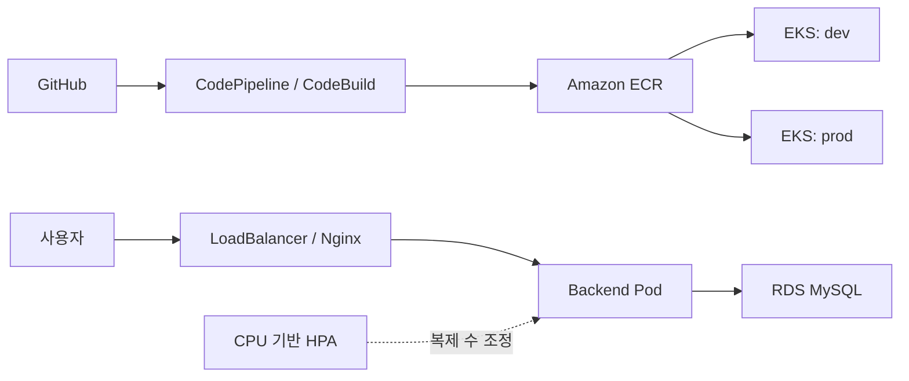

# BookShelf — AWS EKS CI/CD

도서 관리 서비스를 컨테이너로 배포하고, 개발·운영 환경과 자동 확장을 구성한 프로젝트입니다.
**이도훈의 담당 영역: Docker · ECR · EKS 배포 · 환경 분리 · HPA**

| 기간 | 구분 | 역할 |
|---|---|---|
| 2026.06 | KT AIVLE 미니프로젝트 6차 · 팀 프로젝트 | 컨테이너·AWS 배포 담당 |

## 내가 맡은 일

| 핵심 기여 | 구현 내용 | 근거 |
|---|---|---|
| 컨테이너화·빌드 | FE/BE Dockerfile, ECR 업로드, CodeBuild 단계 구성 | [Dockerfile](backend/Dockerfile) · [빌드 설정](buildspec.yml) |
| 배포 환경 분리 | EKS Deployment·Service, dev/prod namespace, 환경별 배포 단계 | [PR #2](https://github.com/aivle-b-t24/6-mini-project24/pull/2) · [배포 설정](k8s) |
| 경로·자원 조정 | Nginx API 경로 수정, requests/limits와 CPU 기반 HPA | [Nginx](frontend/nginx.conf) · [HPA](k8s/prod/backend-hpa.yaml) |

웹 기능과 DB 연동은 팀 공동 결과이며, 위 표는 개인 담당 범위입니다.

## 결과와 문제 해결

- 개발·운영 namespace별 서비스와 컨테이너 기동을 확인했습니다.
- 부하 테스트에서 백엔드 Pod **2→3 확장**, Deployment **3/3 Ready**를 확인했습니다.

**DB 연결 한도를 고려한 확장 상한 조정**

Pod를 늘릴 때 DB 연결 수도 함께 증가하므로, DB 연결 한도를 고려해 백엔드 HPA 최대 복제 수를 **5→3**으로 낮췄습니다.
최소 2개·최대 3개·CPU 목표 50%로 설정하고, 부하에 따라 Pod가 늘어나는지 확인했습니다.

[설정 변경 커밋](https://github.com/aivle-b-t24/6-mini-project24/commit/c0413d5)

## 구조와 실행 화면

팀 서비스의 전체 흐름입니다. 개인 기여는 위 표에서 구분했습니다.

**개발 파이프라인 실행 기록**

**부하에 따른 Pod 확장 기록**

기존 dev/prod 데모 주소는 **현재 접속 불가**입니다(2026.09.20 DNS 확인).
위 이미지는 프로젝트 수행 당시의 실행 기록입니다.

## 더 보기

- [실행 방법·CI/CD·모니터링 상세](docs/technical-details.md)
- [개발 환경 manifest](k8s/dev) · [운영 환경 manifest](k8s/prod)
- [팀 저장소](https://github.com/aivle-b-t24/6-mini-project24)

이 저장소는 팀 프로젝트의 개인 포트폴리오용 포크입니다. 원본과 팀원의 커밋 이력을 보존합니다.
